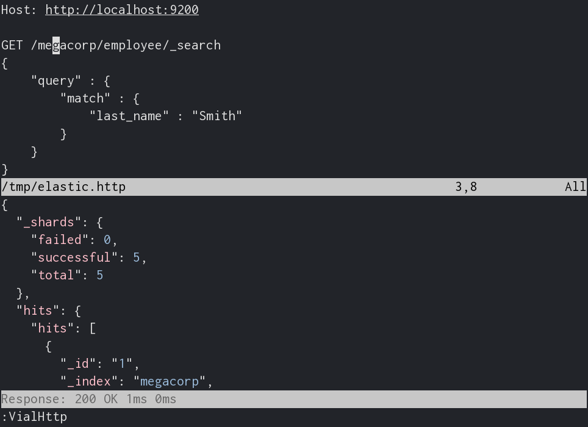

# vial-http
Simple http rest tool for vim

## Features:

* Intuitive syntax
* Response and connection times
* Automatic json response formatter
* Separate buffers for response body, response headers and request
* DRY
* Support for HTTP basic auth

## Install

vial-http is pathogen friendly and only requires vial to be installed::

    cd ~/.vim/bundle
    git clone https://github.com/baverman/vial.git
    git clone https://github.com/baverman/vial-http.git

Note: vim should be compiled with python (not python3) support.

## Docs

`:VialHttp`: command executes request line under the cursor
`VialHttpBasicAuth()`: function makes `Authorization` header

[Example session](doc/example.http)

Example binds to cycle between req/resp buffers:

    au BufNewFile __vial_http__ nnoremap <buffer> <silent> <c-k> :b __vial_http_req__<cr>
    au BufNewFile __vial_http_req__ nnoremap <buffer> <silent> <c-k> :b __vial_http_hdr__<cr>
    au BufNewFile __vial_http_hdr__ nnoremap <buffer> <silent> <c-k> :b __vial_http__<cr>

